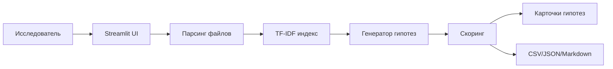

# Фабрика гипотез

Локальный Streamlit-прототип для задачи Норникель AI Hackathon: генерация, обоснование и ранжирование проверяемых НИОКР-гипотез по базе знаний исследовательской лаборатории.

## Что делает приложение

- Принимает цель/KPI, ограничения, доступное сырье, оборудование и веса критериев ранжирования.
- Загружает базу знаний из `txt`, `md`, `pdf`, `docx`, `csv`, `xlsx`.
- Разбивает документы на фрагменты, строит TF-IDF индекс и находит релевантные цитаты.
- Генерирует проверяемые гипотезы по шаблонам материаловедения и металлургических процессов.
- Оценивает гипотезы по новизне, реализуемости, ожидаемой ценности, риску и уверенности источников.
- Показывает граф связей "гипотеза - фактор - источник".
- Экспортирует результат в CSV, JSON и Markdown-отчет.

## Быстрый запуск

```powershell
python -m venv .venv
.\.venv\Scripts\Activate.ps1
pip install -r requirements.txt
python app.py
```

Если пользователь не загрузит файлы, приложение использует демо-базу из `data/sample_knowledge`.

## Опционально: Yandex AI Studio

Не храните API-ключ в репозитории. Перед запуском задайте переменные окружения:

```powershell
$env:YANDEX_API_KEY="ваш_api_ключ"
$env:YANDEX_FOLDER_ID="ваш_folder_id"
# Необязательно: $env:YANDEX_MODEL="yandexgpt/latest"
python app.py
```

Если переменные заданы, в интерфейсе появится экспертная сводка YandexGPT поверх ранжированных гипотез. Без этих переменных приложение работает в офлайн-режиме.

## Демо-сценарий

1. Оставьте цель по умолчанию: повысить жаропрочность никелевого сплава на 15%.
2. Проверьте ограничения, сырье и оборудование в боковой панели.
3. Нажмите "Сгенерировать гипотезы".
4. Покажите жюри таблицу ранжирования, карточки гипотез, цитаты источников и дорожную карту проверки.
5. Скачайте Markdown-отчет или JSON как пример интеграции с внешними системами.

## Архитектура



## Почему это подходит под кейс

Решение не просто генерирует текст, а сохраняет трассировку к источникам: каждая гипотеза содержит цитаты, механизм влияния, риски, ресурсы и план проверки. Веса критериев задаются экспертом, поэтому можно менять стратегию ранжирования под конкретную лабораторию, бюджет или горизонт проверки.

Базовый прототип работает локально и не требует внешних API. Это важно для конфиденциальных промышленных данных и для стабильного демо. Опциональный слой Yandex AI Studio добавляет экспертную сводку, но не заменяет retrieval/scoring и не ломает офлайн-режим.
