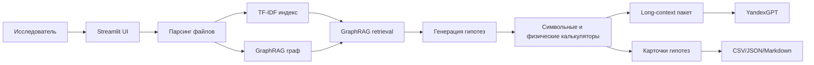

# Фабрика гипотез

Streamlit-прототип для задачи Норникель AI Hackathon: гибридная система на стыке GraphRAG, Long-Context LLM и внешних символьных/физических калькуляторов.

## Что делает приложение

- Принимает цель/KPI, ограничения, доступное сырье, оборудование и веса критериев ранжирования.
- Загружает базу знаний из `txt`, `md`, `pdf`, `docx`, `csv`, `xlsx`, `png`, `jpg`, `jpeg`, `webp`.
- Разбивает документы на фрагменты, строит TF-IDF индекс и GraphRAG-граф материалов, процессов, свойств и источников.
- Запускает гибридный пайплайн: ingestion, GraphRAG retrieval, генерация гипотез, расчетная валидация, подготовка long-context для LLM.
- Генерирует проверяемые гипотезы по шаблонам материаловедения и металлургических процессов.
- Проверяет гипотезы внешними калькуляторами: стоимость легирования, наличие оборудования, термоокно, баланс процесса.
- Оценивает гипотезы по новизне, реализуемости, ожидаемой ценности, риску и уверенности источников.
- Показывает граф связей "гипотеза - фактор - источник".
- Экспортирует результат в CSV, JSON и Markdown-отчет.

## Быстрый запуск

```powershell
python -m venv .venv
.\.venv\Scripts\Activate.ps1
pip install -r requirements.txt
python app.py
```

Если пользователь не загрузит файлы, приложение использует встроенную демо-базу `data/sample_knowledge`.

## Запуск в Docker

Создайте `.env` на основе `.env.example`, затем запустите:

```powershell
docker compose up --build
```

Приложение будет доступно на `http://localhost:8502`. Compose пробрасывает `.env` внутрь контейнера и монтирует `./data` в `/app/data`.

## Опционально: Yandex AI Studio

Не храните API-ключ в репозитории. Перед запуском задайте переменные окружения:

```powershell
$env:YANDEX_API_KEY="ваш_api_ключ"
$env:YANDEX_FOLDER_ID="ваш_folder_id"
# Необязательно: $env:YANDEX_MODEL="yandexgpt/latest"
python app.py
```

Если переменные заданы, приложение автоматически добавляет long-context сводку YandexGPT поверх GraphRAG-контекста, гипотез и расчетных проверок. Без этих переменных приложение работает в офлайн-режиме.

## Демо-сценарий

1. Запустите `python app.py`.
2. При необходимости загрузите свои документы, таблицы или изображения через боковую панель.
3. Нажмите "Сгенерировать гипотезы".
4. Покажите жюри GraphRAG-метрики, таблицу ранжирования, карточки гипотез, цитаты источников, калькуляторы и дорожную карту проверки.
5. Скачайте Markdown-отчет или JSON как пример интеграции с внешними системами.

## Архитектура



## Почему это подходит под кейс

Решение не просто генерирует текст, а сохраняет трассировку к источникам и промежуточным расчетам: каждая гипотеза содержит цитаты, GraphRAG-обоснование, механизм влияния, расчетные проверки, риски, ресурсы и план проверки. Веса критериев задаются экспертом, поэтому можно менять стратегию ранжирования под конкретную лабораторию, бюджет или горизонт проверки.

Базовый прототип работает локально и не требует внешних API. Это важно для конфиденциальных промышленных данных и для стабильного демо. Опциональный слой Yandex AI Studio получает уже структурированный long-context пакет и добавляет экспертную сводку, но не заменяет GraphRAG/scoring/calculators и не ломает офлайн-режим.
