# Фабрика гипотез

Streamlit-прототип для задачи Норникель AI Hackathon: гибридная система на стыке GraphRAG, обязательного Long-Context LLM слоя Alice AI LLM и внешних символьных/физических калькуляторов.

## Что делает приложение

- Принимает цель/KPI, ограничения, доступное сырье, оборудование и веса критериев ранжирования.
- Загружает базу знаний из `txt`, `md`, `pdf`, `docx`, `csv`, `xlsx`, `png`, `jpg`, `jpeg`, `webp`.
- Разбивает документы на фрагменты, строит устойчивый hashing retrieval индекс и GraphRAG-граф материалов, процессов, свойств, параметров и источников.
- Запускает гибридный пайплайн: ingestion, GraphRAG retrieval, генерация гипотез, расчетная валидация и обязательная long-context сводка Alice AI LLM.
- Генерирует проверяемые гипотезы по шаблонам материаловедения и металлургических процессов.
- Проверяет гипотезы внешними калькуляторами: стоимость легирования, наличие оборудования, прогноз KPI-эффекта, термоокно, баланс процесса.
- Выполняет контрфактуальный анализ: baseline, сценарий без ключевого фактора и замена процесса ближайшей альтернативой.
- Запускает предсказательную surrogate-модель `RandomForestRegressor` для оценки ожидаемого KPI uplift.
- Извлекает OCR-текст из изображений при наличии Tesseract (`rus`, `eng`, `chi_sim`); без OCR учитывает изображения как визуальные источники с метаданными.
- Нормализует английские и китайские доменные термины в русскую онтологию (`tailings`, `flotation`, `尾矿`, `浮选` и др.).
- Извлекает метаданные из источников: даты, авторов, условия экспериментов (`pH`, температура, проценты, крупность).
- Оценивает гипотезы по новизне, реализуемости, ожидаемой ценности, риску и уверенности источников.
- Выполняет внешнюю проверку новизны по Crossref, Semantic Scholar и PatentsView с кэшированием результата.
- Обучает легкую ML-модель на экспертном feedback и использует ее при следующих ранжированиях.
- Показывает граф связей "гипотеза - фактор - источник".
- Сохраняет GraphRAG-граф в `JSON`, `GraphML`, `RDF/Turtle` и опционально синхронизирует его в Neo4j.
- Экспортирует результат в CSV, JSON, Markdown, DOCX и PDF-отчет.
- Сохраняет экспертную обратную связь по гипотезам в `data/feedback.json`.
- Предоставляет HTTP API `/api/generate`, role-based token auth и отправку гипотез в Jira/YouTrack.

## Публичное демо

- UI: `https://hackaton.baxic.ru`
- API: `https://hypothesisapi.baxic.ru`
- API Docs: `https://hypothesisapi.baxic.ru/docs`
- Healthcheck: `https://hypothesisapi.baxic.ru/health`

Если задан `API_AUTH_TOKEN`, API-запросы должны передавать заголовок `X-API-Key`.

Реальные токены не хранятся в README и задаются в `.env` на сервере:

```env
APP_AUTH_TOKEN=<UI access token>
API_AUTH_TOKEN=<API access token>
# опционально несколько ролей:
APP_TOKENS=viewer-token:viewer,expert-token:expert,admin-token:admin
API_TOKENS=reader-token:viewer,research-token:researcher,admin-token:admin
```

Для передачи жюри используйте отдельный demo-token с ролью `expert` для UI и `researcher` для API. Не публикуйте реальные токены Jira, YouTrack, Yandex AI Studio и Neo4j в репозитории.

Пример:

```bash
curl -X POST https://hypothesisapi.baxic.ru/api/generate \
  -H "Content-Type: application/json" \
  -H "X-API-Key: <API_AUTH_TOKEN>" \
  -d '{"target":"снизить потери Ni в хвостах","limit":3}'
```

## API Reference

Базовый endpoint генерации:

```text
POST /api/generate
```

Поля запроса:

- `target` — целевое свойство или технологическая проблема.
- `constraints` — ограничения по сырью, бюджету, оборудованию, нормативам.
- `available_materials` — доступные материалы или сырье.
- `equipment` — доступное лабораторное/производственное оборудование.
- `budget` — ограничения по срокам и бюджету.
- `weights` — веса критериев `novelty`, `feasibility`, `expected_value`, `risk`, `confidence`.
- `limit` — количество гипотез, от `1` до `12`.
- `documents` — массив переданных документов `{source, text, metadata}`. В API передается уже извлеченный текст: содержимое отчета, статьи, таблицы, OCR изображения или краткое описание источника. Если `documents` пустой, используется встроенная demo-база знаний.

Минимальный request body:

```json
{
  "target": "снизить потери Ni/Cu в хвостах флотации",
  "constraints": "лабораторная проверка до 2 недель; без капитальных изменений схемы",
  "available_materials": "хвосты флотации, известь, собиратель, вспениватель",
  "equipment": "флотомашина, мельница, классификатор, pH-метр",
  "budget": "пилотный лабораторный скрининг",
  "limit": 3,
  "documents": [
    {
      "source": "flotation_report.txt",
      "text": "Отчет по хвостам флотации: повышенные потери Ni/Cu наблюдаются в классе +71 мкм. В пробах указаны pH 8.5-9.5, реагентный режим и необходимость проверки доизмельчения перед перечисткой.",
      "metadata": {
        "type": "lab_report",
        "year": "2024"
      }
    },
    {
      "source": "scheme_ocr.txt",
      "text": "OCR схемы: основная флотация, перечистка, хвостовой поток, контроль крупности и pH.",
      "metadata": {
        "type": "image_ocr"
      }
    }
  ]
}
```

Ответ содержит:

- `brief` — нормализованный исследовательский запрос.
- `hypotheses` — ранжированный список гипотез с источниками, score, рисками, планом проверки и расчетами.
- `yandex_summary` — обязательная long-context экспертная сводка Alice AI LLM по GraphRAG-контексту и расчетам.
- `steps` — трассировка агентного пайплайна.
- `graph_stats` — статистика GraphRAG-графа.
- `graph_paths` — пути к `JSON`, `GraphML`, `RDF/Turtle` и статус Neo4j sync.
- `api_role` — роль токена, с которым выполнен запрос.

Если задан `API_AUTH_TOKEN` или `API_TOKENS`, передавайте:

```http
X-API-Key: <token>
```

## Локальный запуск

```powershell
python -m venv .venv
.\.venv\Scripts\Activate.ps1
pip install -r requirements.txt
python app.py
```

Если пользователь не загрузит файлы, приложение использует встроенную демо-базу `data/sample_knowledge`.

## Запуск в Docker

Создайте `.env` на основе `.env.example`, затем запустите:

```powershell
docker compose up --build
```

Приложение будет доступно на `http://localhost:8502`. Compose пробрасывает `.env` внутрь контейнера, монтирует `./data` в `/app/data` и поднимает Neo4j для синхронизации графа.

HTTP API поднимается вторым сервисом на `http://localhost:8503`:

```powershell
curl http://localhost:8503/health
```

Neo4j Browser доступен на `http://localhost:7474`, Bolt endpoint — `bolt://localhost:7687`.

Пример генерации через API:

```powershell
curl -X POST http://localhost:8503/api/generate `
  -H "Content-Type: application/json" `
  -d "{\"target\":\"снизить потери Ni в хвостах\",\"constraints\":\"лабораторная проверка 2 недели\",\"documents\":[{\"source\":\"case.txt\",\"text\":\"tailings flotation pH recovery losses\"}]}"
```

## Yandex AI Studio

Alice AI LLM является обязательным long-context LLM слоем решения. Не храните API-ключ в репозитории. Перед запуском задайте переменные окружения:

```powershell
$env:YANDEX_API_KEY="ваш_api_ключ"
$env:YANDEX_FOLDER_ID="ваш_folder_id"
$env:YANDEX_MODEL="aliceai-llm"
$env:YANDEX_TIMEOUT_SECONDS="15"
python app.py
```

Без `YANDEX_API_KEY` и `YANDEX_FOLDER_ID` генерация в UI блокируется, а API возвращает `503`. Alice AI LLM получает уже структурированный long-context пакет поверх GraphRAG-контекста, гипотез, counterfactual, predictive KPI и расчетных проверок.

Интеграция использует OpenAI-compatible endpoint Yandex AI Studio: `https://ai.api.cloud.yandex.net/v1/responses`.

Если контейнер пишет `Failed to resolve 'ai.api.cloud.yandex.net'`, это DNS/сетевой сбой контейнера, а не ошибка модели. В `docker-compose.yml` для app/API заданы DNS `1.1.1.1` и `8.8.8.8`; после изменения выполните:

```bash
docker compose up -d --build
docker exec hypothesis-factory python -c "import socket; print(socket.gethostbyname('ai.api.cloud.yandex.net'))"
```

## Интеграции

Для прямого создания задач задайте переменные в `.env`.

Jira Cloud:

```powershell
JIRA_BASE_URL=https://your-domain.atlassian.net
JIRA_EMAIL=user@example.com
JIRA_API_TOKEN=your_token
JIRA_PROJECT_KEY=LAB
```

YouTrack:

```powershell
YOUTRACK_BASE_URL=https://youtrack.example.com
YOUTRACK_TOKEN=perm:...
YOUTRACK_PROJECT_ID=0-0
```

Внешнюю проверку новизны можно отключить для полностью офлайн-демо:

```powershell
NOVELTY_CHECK_ENABLED=0
```

Опциональная авторизация:

```powershell
APP_AUTH_TOKEN=local-ui-token
API_AUTH_TOKEN=external-api-token
# или несколько токенов с ролями
APP_TOKENS=viewer-token:viewer,expert-token:expert,admin-token:admin
API_TOKENS=reader-token:viewer,research-token:researcher,admin-token:admin
```

При заданном `API_AUTH_TOKEN` внешние клиенты должны передавать заголовок `X-API-Key`.

Опциональная синхронизация графа в Neo4j:

```powershell
NEO4J_URI=bolt://neo4j:7687
NEO4J_USER=neo4j
NEO4J_PASSWORD=password
NEO4J_DATABASE=neo4j
```

## Архитектура

```mermaid
flowchart LR
    user["Исследователь"] --> ui["Streamlit UI"]
    ui --> ingestion["Парсинг файлов"]
    ingestion --> textIndex["Hashing retrieval индекс"]
    ingestion --> graphIndex["GraphRAG граф сущностей и параметров"]
    textIndex --> graphRetrieval["GraphRAG retrieval"]
    graphIndex --> graphStore["JSON/GraphML/RDF + Neo4j query"]
    graphIndex --> graphRetrieval
    graphRetrieval --> generator["Генерация гипотез"]
    generator --> counterfactual["Counterfactual analysis"]
    counterfactual --> calculators["Символьные и физические калькуляторы"]
    calculators --> novelty["Crossref/S2/Patents novelty"]
    calculators --> predictive["Predictive KPI model"]
    predictive --> feedback["ML feedback reranking"]
    feedback --> llmContext["Long-context пакет"]
    llmContext --> yandex["Alice AI LLM обязательный LLM слой"]
    feedback --> cards["Карточки гипотез"]
    cards --> exports["CSV/JSON/Markdown/DOCX/PDF"]
    cards --> trackers["Jira/YouTrack/API"]
```



## Почему это подходит под кейс

Решение не просто генерирует текст, а сохраняет трассировку к источникам и промежуточным расчетам: каждая гипотеза содержит цитаты, GraphRAG-обоснование, механизм влияния, расчетные проверки, прогнозный диапазон KPI-эффекта, риски, ресурсы и план проверки. Веса критериев и экспертная обратная связь помогают менять стратегию ранжирования под конкретную лабораторию, бюджет или горизонт проверки.

Базовый GraphRAG/scoring/calculators слой работает локально, а Alice AI LLM является обязательным long-context экспертным модулем для финальной сводки. Дополнительные внешние слои Crossref/Semantic Scholar/PatentsView, Neo4j и Jira/YouTrack подключаются через `.env`, но не заменяют GraphRAG/scoring/calculators.

## Соответствие требованиям кейса

Проект закрывает требования кейса на уровне хакатонного MVP: это комплексная "Фабрика гипотез", а не только RAG-чат.

- Полезность для исследователей: гипотезы конкретные, проверяемые, с механизмом влияния, ресурсами, рисками и дорожной картой проверки.
- Прозрачность и обоснованность: есть цитаты источников, GraphRAG-связи, объяснимые пути в графе, расчетные проверки, novelty-check и counterfactual explanation.
- Гибкость входных данных: поддержаны `txt/md/pdf/docx/csv/xlsx/png/jpg/jpeg/webp`, OCR, fallback для шумных данных, метаданные и мультиязычная нормализация.
- Масштабируемость: архитектура модульная — ingestion, retrieval, GraphRAG, calculators, counterfactual, predictive KPI, novelty, feedback, exporters, API. Граф хранится в `JSON/GraphML/RDF` и Neo4j.
- Интеграция: есть публичный API, Swagger, CSV/JSON, PDF/DOCX, Jira/YouTrack, Docker Compose и Neo4j.

Функциональные требования также закрыты:

- Прием и предобработка данных: парсинг документов, таблиц, изображений, OCR, метаданные — даты, авторы, условия экспериментов, `pH`, температура, проценты, крупность.
- Генерация гипотез: извлечение сущностей и связей, паттерны, контрфактуальный анализ, predictive KPI model и ranking.
- Обоснование и визуализация: карточки гипотез, граф связей, GraphRAG-контекст, источники, цитаты, риски, uncertainty через confidence/risk/novelty.
- Экспорт и интеграция: PDF/DOCX, CSV/JSON/Markdown, API, Jira/YouTrack, feedback learning.

Нефункциональные требования:

- Интерпретируемость: каждый шаг виден через agent trace, источники, граф, калькуляторы, novelty и counterfactual.
- Мультиязычность: OCR `rus+eng+chi_sim`, нормализация английских и китайских терминов в русскую онтологию.
- Надежность: fallback для пустых и шумных данных, `HashingVectorizer`, локальный базовый GraphRAG/scoring слой и обязательная Alice AI LLM-сводка при настроенных ключах.
- Производительность: генерация рассчитана на интерактивный режим, без тяжелых моделей в основном цикле.
- Безопасность: локальный Docker-контур, UI token, API token, role-based access, Neo4j во внутренней сети.

Ограничения MVP честно обозначены: novelty screening не заменяет промышленную патентную экспертизу, predictive KPI surrogate не является полноценной физико-химической симуляцией, token-based RBAC не заменяет корпоративный SSO. Для хакатонного решения эти ограничения компенсируются интерпретируемостью, модульностью и готовностью к интеграции.

Короткая формулировка для защиты:

> Мы реализовали гибридную агентную фабрику гипотез: GraphRAG + Long-Context LLM + counterfactual analysis + predictive KPI model + novelty screening + expert feedback learning, с экспортом в отчеты, API, таск-трекеры и Neo4j-backed graph storage.
